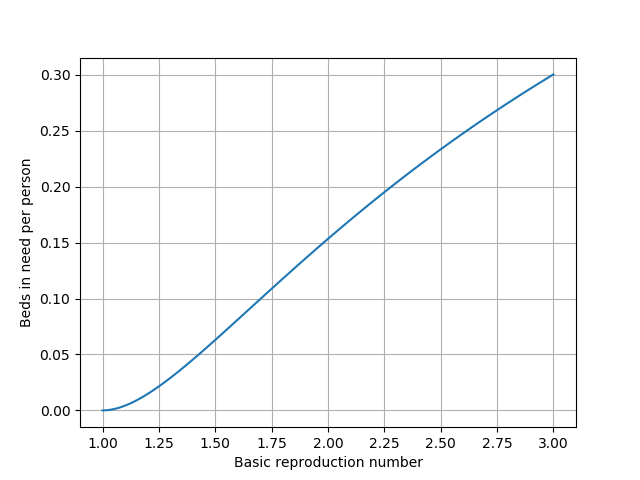

*This article is a partial translation of [this](https://zhuanlan.zhihu.com/p/113031098)*

# What is the cost of negative reaction towards Corona virus

It is known to all that the UK takes delay phase to prevent Corona virus negatively, as what ancient human or even animals would do: Let as many as necessary people to be infected, so as to stop spreading of the COVID-19. It is reported unofficially that German, France and Japan tend to adapt this measure as well.

Here a simple simulation is conducted to shown whether the measure proposed by the UK has the declared positive effect, i.e. NHS would not break down due to severe break out of COVID-19 and hence the fatality could be under control.

A four-phase model is considered:

Sensitivity($s$) -> Incubation($h$) -> Infection($i$) -> Recover or Fatality($r$)

We denote $i$, $h$, $i$, $r$ as the corresponding ratio in the population. We assume

- All infections are well isolated under the control of government, i.e. only people in incubation period spread the virus. The reproduction rate is $\lambda$.

- The recovered people should have lifelong immunity.

- The average incubation period is $1/\alpha$ and the average cure period is $1/\beta$ (after which the infection will die or recover).

Hence, we have
$\cfrac{\rm{d}s}{\rm{d}t}=-\lambda hs$...(1)
$\cfrac{\rm{d}h}{\rm{d}t}=\lambda hs-\alpha h$...(2)
$\cfrac{\rm{d}i}{\rm{d}t}=\alpha h-\beta i$...(3)

When the number of people in the incubation period is most (at time $t_0$), the derivative of $h$ is zero. Rearranging gives $s_0=\alpha/\lambda$, which indicates the ratio of healthy people. 

The inverse of $s_0$, $\lambda/\alpha$, however, is the definition of $R_0$, basic reproduction number. Note here we assume only people in the incubation period will spread the virus. 

The number $R_0$ for COVID-19 is about 2~3, which might be less when corrected.

With a constant total population, the number of total infection (including incubation, recovered and fatality) is $h_0+i_0+r_0=1-\alpha/\lambda$, which is about 60%~70%. That's why the politician said 60%~70% people would be infected.

Dividing (2) by (3) gives $\cfrac{\rm{d}h}{\rm{d}s}=-1+\cfrac{\alpha}{\lambda s}$, integrating which gives $h=1-s+\cfrac{\alpha}{\lambda}\ln{s}$.

Substituting $s$ with $s_0$ gives $h_0=1-\cfrac{\alpha}{\lambda}\left(1+\ln{\cfrac{\lambda}{\alpha}}\right)$.

We are concerning about whether the NHS is available for infection, so we focus on the number of infection. Easy to get,

$i(t)=\int^{t}\alpha h(\tau)\exp\left[-\beta(t-\tau)\right]\rm{d}\tau$

The approximate solution is $i_0=i(t_0)\approx\cfrac\alpha\beta h_0$.

The average incubation period is 3~7 days, while the average cure period is 20~30 days, so $\alpha/\beta$ gives a gain of 5.

The severe infections take up about 20%, which, according to the policy, need beds in the hospital. Therefore, the relationship between the number of beds in need per person ($n_0$) and the basic reproduction number is

$n_0=1-(1+\ln{R_0})/R_0$,

which is depicted below.

As shown, $n_0$ increases quite rapidly with a higher $R_0$.

According to [this](​www.indexmundi.com), the actual $n$ in the UK is 2.8/1000 (common beds, may not satisfy the requirements of infectious disease). In order to make $n$ equal to or less than this, the $R_0$ should be less than 1.08. If the UK can do this, why don't the UK suppress $R_0$ to be less than $1$, the cost of which is much less than all people infected?

Besides, the assumption makes the situation more acceptable. But in the reality, the situation is worse.

- A common bed may not satisfy the requirements of a infectious disease, so the $n$ would be less;

- According to recent records, the measures encouraged in the Europe (washing hands, self-isolation and cancellation of large scale meeting) cannot reduce $R_0$;

- Thanks to the experience of other Corona virus, the immunity of it is not lifelong, but lasts several months or one year, i.e. the virus will not die out due to herd immunity. On the contrary, it will stay with human until powerful vaccine occurs.
